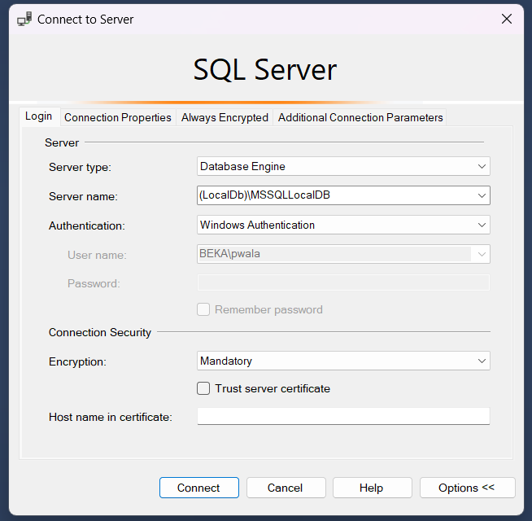
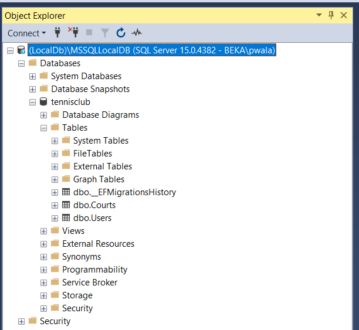
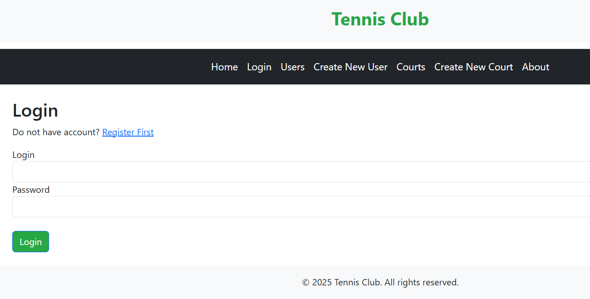
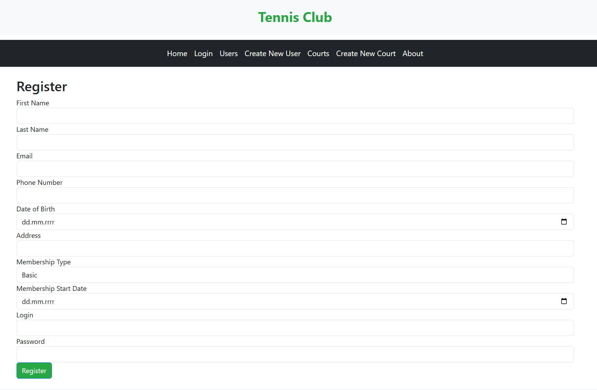
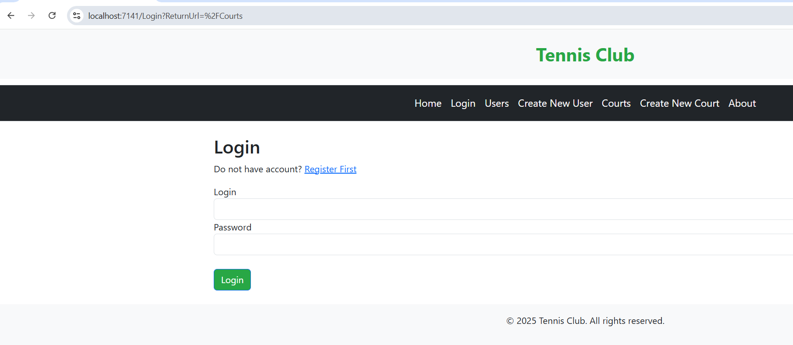
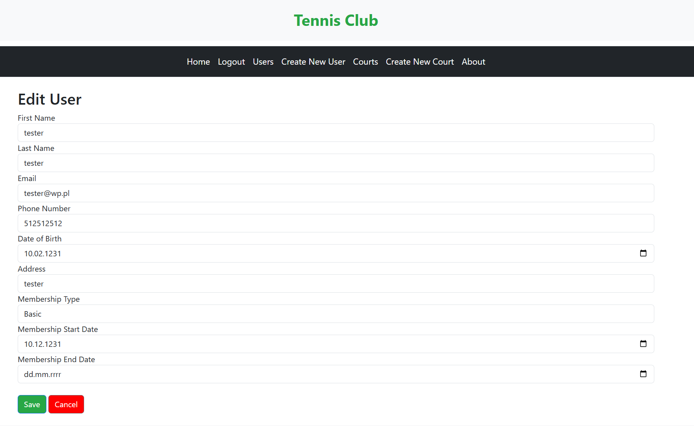
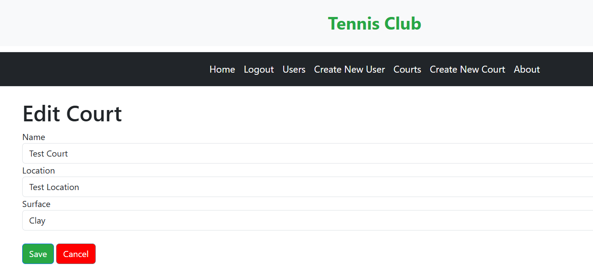

# Razor Pages and MVP Project for Tennis Club Management

## Overview

This project is a Razor Pages and MVP (Model-View-Presenter) architecture-based application designed to manage tennis club user data. 
The application interacts with a database using Entity Framework Core with SQL Server as the provider. 
It provides functionality for CRUD operations on user data.

## Prerequisites

Before getting started, ensure you have the following installed:

1. **Visual Studio** or any .NET IDE of your choice.
2. **.NET Core SDK** version 3.1 or higher.
3. **SQL Server** and a SQL Server instance set up.

### Required NuGet Packages:

The project requires the following NuGet packages:

```bash
dotnet add package Microsoft.EntityFrameworkCore --version 5.0.0
dotnet add package Microsoft.EntityFrameworkCore.SqlServer --version 5.0.0
dotnet add package Microsoft.EntityFrameworkCore.Tools --version 5.0.0
```


## Download Repository

1. Clone the repository using Git:

```bash 
git clone https://github.com/pwalaszkowski/tennisclub_dotnet.git
cd tennisclub_dotnet
```

2. Open the solution file (.sln) using Visual Studio or your preferred IDE.

## Installing NuGet packages

1. Run the following commands in the Package Manager Console (PMC) to
install the required NuGet packages:

```bash 
dotnet restore
dotnet add package Microsoft.EntityFrameworkCore
dotnet add package Microsoft.EntityFrameworkCore.SqlServer 
dotnet add package Microsoft.EntityFrameworkCore.Tools
```

## Project Structure

1. In the Models folder, you will find the User, Court, ErrorView models
2. In the Controllers/Data folder, you will find the ApplicationDbContext class that represents the database context
3. In the Controllers there Controllers for Courts and Users

## First Migration 

To create the initial migration for the database schema:

1. Open the Package Manager Console (PMC).
2. Navigate to your project directory.
3. Run commands

```bash 
dotnet ef migrations add InitialCreate
dotnet ef database update
```

This will create the InitialCreate migration, scaffold the database schema, and apply the 
migration to your SQL Server instance. In order to confirm that database is created correctly
Login into you SQL Server Instance and check the schema:



Database Tables:



## Running the Application

1. Set the appropriate connection string in your appsettings.json file:

```json
{
  "ConnectionStrings": {
    "DefaultConnection": "Your SQL Server Connection String Here"
  }
}
```

2. Run the application using Visual Studio or the command line:

```bash 
dotnet run
```

3. Access the application by navigating to https://localhost:7141/ in your browser.

## Application Description

### Login/Register
In order to use the application the user need to create an account and login

* Login Screen



* Registration Screen



* Exceptions/Errors catching
  * The application will catch following exceptions:
    * Already existing user/email
    * Password is shorter than 8 characters
    * Incorrect Password/Nonexistent User Trying to Log in

### Session/Authentication Management
The session time is set to 30 minutes and it is managed in `Program.cs` file

```bash
  config.ExpireTimeSpan = TimeSpan.FromMinutes(30); // Session expires after 30 minutes
```

### Restricted Access
Not authorized users, will be redirected to Login screen, even they would like to type correct 
subpage url.



### Users Creation
The users can create new users/edit and delete existing ones



### Courts Creation
The users can create new courts/edit and delete existing ones.



### Courts Reservation
This feature is planned in future